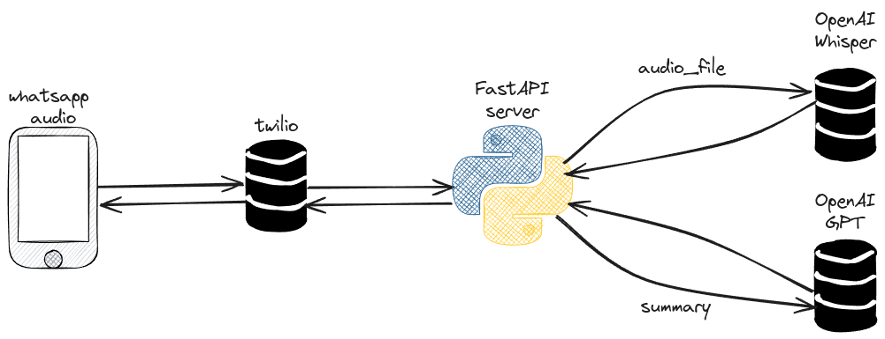

# Whatdahell

A WhatsApp bot that transcribes audio messages and sends them to OpenAI's Whisper API for text generation.

## How it works



The bot listens for audio messages in WhatsApp and transcribes them using OpenAI's Whisper API. If the transcription is longer than 40 words, it sends the transcription to OpenAI's Gpt API for summary generation.

## Dependencies

- Python 3.11
- OpenAI API key
- Twilio API key
- python-dotenv
- fastapi
- python-multipart

## Installation

1. Clone the repository
2. Create a `.env` file in the root directory with the following variables:

```
OPENAI_API_KEY=<your_openai_api_key>
TWILIO_ACCOUNT_SID=<your_twilio_account_sid>
TWILIO_AUTH_TOKEN=<your_twilio_auth_token>
```

3. Install the dependencies by running `pip install -r requirements.txt`
4. Run the app by running `uvicorn app:app`

## Usage

1. For run locally, you can use ngrok to expose your local server to the internet. Follow the instructions on the ngrok website to set up ngrok.
2. Once you have ngrok running, you can use the ngrok URL to set up your WhatsApp webhook. Follow the instructions on the Twilio website to set up the webhook.
3. Send a message to the bot and it will transcribe the audio and send it to OpenAI's Whisper API for text generation.

## Contributing

Contributions are welcome! If you find any bugs or have suggestions for improvements, please open an issue or submit a pull request.

## License

This project is licensed under the MIT License.